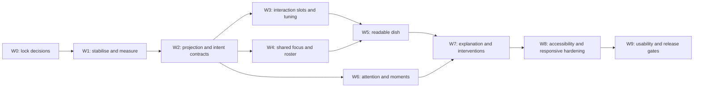

# Phase 2.5 execution plan — make the civilisation readable and dramatic

Status: **proposed implementation plan**  
Prepared: **1 August 2026**  
Roadmap source: [`PROGRESS.md`](../PROGRESS.md#phase-25--make-the-civilisation-readable-and-dramatic)  
Target: the existing eight-creature Petri-world vertical slice

This document turns the Phase 2.5 roadmap into an implementation-ready sequence. It does not replace the product goals in `PROGRESS.md`; it defines the contracts, dependencies, work packages, verification layers, provisional targets, and release gates needed to deliver them safely.

No calendar estimate is assigned yet. The first work package establishes the measurement definitions and team capacity needed to estimate the remaining work without disguising uncertainty as a date.

## 1. Outcome

For curious players observing a small autonomous society, Tiny Civilisation should make it possible to recognise individual creatures, understand what they want and are doing, notice an important social turn, alter one environmental condition, and trace the consequence back to retained facts. It should feel **alive, legible, and evidence-led**, not managerial, dashboard-heavy, or scripted.

Phase 2.5 succeeds when the dish itself carries the story:

> Recognise a creature -> understand its desire -> see its plan and current action -> notice a tension -> change one condition -> watch the response -> inspect the factual explanation.

The interface remains a field notebook around a living specimen. The notebook directs attention and preserves evidence; it must not displace the dish as the dominant surface.

## 2. Why this phase is necessary

The existing implementation has a strong deterministic experiment foundation, but the live experience hides too much of the simulation's meaning.

- `ActiveGoal.kind` and `ActiveAction.kind` are both `ActionKind`; the UI therefore presents an action-like goal and an action rather than a persistent desire, a plan, an action, and a reason.
- Every action paths to an entity's exact tile or a single group-home tile. Rest, construction, storage, guarding, sharing, and conflict naturally collapse creatures into the same position.
- `KEEP` is always considered while a creature carries food and resolves as a stationary no-op. A 5,000-tick diagnostic over seeds 4182, 921, and 23 found it at roughly 80% of completed actions.
- The same diagnostic found average occupied-creature-tile counts of only 2.09, 1.31, and 2.23, overlap on 99.8% of ticks, and maximum crowding of all eight creatures.
- Important events are front-loaded and then become quiet: the three reference runs contained trailing stretches of roughly 3,000–4,500 ticks without an importance-18-or-higher event.
- Creatures are rendered as color circles with a group dot. Identity, carrying, direction, action family, interaction position, and route are not visible.
- Pointer selection, event selection, causal focus, following, and camera focus are separate pieces of state. Keyboard input can pan and zoom the canvas but cannot browse creatures or world objects.
- Intervention outcomes are matched in the web layer by tick, type, tile, and sometimes event prose. Events do not retain a command ID or typed rejection/response reason.
- The hot Worker frame contains a full detached `SimulationState` and a render snapshot. The main thread then rebuilds the view from the state and hashes it again. Local diagnostics measured about 0.9 MB at tick 1,000 and 1.19 MB at tick 5,000 for the combined JSON payload; richer Phase 2.5 state would amplify this path.

These measurements are diagnostic evidence, not release targets. Work package 1 formalises them with a versioned collector and repeatable corpus.

### Current verification baseline

The repository is healthy before Phase 2.5 work begins. This is the regression floor, not evidence that the new product gates already pass.

| Check                   | Current result                                                                                                |
| ----------------------- | ------------------------------------------------------------------------------------------------------------- |
| Full local gate         | `npm.cmd run check` passes: format, lint, strict types, coverage, production build, and six Chromium journeys |
| sim-core tests/coverage | 48 tests; 88.95% statements, 78.70% branches, 94.05% functions, 90.82% lines                                  |
| web tests/coverage      | 34 tests; 54.34% statements, 44.78% branches, 70.18% functions, 55.81% lines                                  |
| Browser visuals         | tick-0 screenshots at 390×844, 1024×768, and 1440×960                                                         |
| Headless benchmark      | about 23.1–24.2k ticks/s locally; current CI floor 12,874 ticks/s                                             |
| Browser bundle          | main chunk 508.78 kB minified / 149.28 kB gzip; Vite emits the >500 kB warning                                |
| Known coverage gap      | Pixi world, camera, layer, and runtime modules have 0% unit coverage and rely on real-browser checks          |

The sim-core branch-coverage margin is only 0.70 percentage points above its current floor. New critical policy modules need focused coverage rather than relying on aggregate headroom.

## 3. Scope and non-goals

### In scope

- Persistent desires, plans, physical actions, and structured factual reasons.
- Deterministic interaction footprints, slot claims, crowding-aware targeting, and stationary-behaviour tuning.
- A projection-only live Worker path suitable for richer observation data.
- An eight-creature roster, shared focus model, readable character/world marks, routes, destinations, and action feedback.
- Central event-importance policy, speed-aware cues, optional pacing, moment cards, clustering, and deterministic moment replay.
- Progressive creature and event explanations grounded in retained facts.
- Intervention preview, typed rejection recovery, and factual response tracing.
- Keyboard and textual world navigation, live summaries, touch parity, high-zoom reflow, reduced-motion equivalents, and responsive layouts.
- Product metrics, deterministic fixtures, migrations, performance budgets, usability sessions, and documentation alignment.

### Explicitly out of scope

- Structural Phase 3 scenario expansion or procedural map generation.
- Water, shelter, lifecycle, culture, migration, territory, trade, seasons, disease, predators, technology, or larger populations.
- Victory conditions, quests, direct creature orders, or outcome prediction.
- Asset-heavy character art, skeletal animation, voice-over, or LLM narration.
- Cross-device persistence, accounts, or a named experiment library.
- A broad restyle of the field-notebook visual system.

New nouns are allowed only when they are observation contracts needed to expose existing behaviour: desire, plan, reason fact, interaction slot, focus reference, attention tier, moment marker, and intervention response.

## 4. Non-negotiable engineering rules

1. `sim-core` remains the authority for desires, decisions, positions, events, facts, and intervention responses.
2. React and Pixi remain read-only consumers of typed projections.
3. Stable iteration order, integer/fixed-point state, keyed randomness, and deterministic tie-breaking remain explicit.
4. Every intentional outcome change increments `SIMULATION_BEHAVIOR_VERSION` and receives a reviewed golden-corpus update.
5. Every authoritative shape change has an explicit state version and migration or an explicit incompatibility path; it is never silently coerced.
6. Plain-language summaries may select and format retained facts, but may not invent motive, certainty, causality, or consequence.
7. Animation can reinforce information but cannot be the only carrier of identity, direction, action, alert, or event importance.
8. Performance, accessibility, responsiveness, and recovery are acceptance criteria within each work package, not final cleanup.

## 5. Delivery map



W0–W3 are the critical path. Once the v2 projection and focus contracts are stable, roster/component work and event-policy work can proceed in parallel. Visual tuning must not begin before slot mechanics exist, because rendering offsets cannot repair authoritative spatial collapse.

## 6. Decisions to lock before feature code

Record these decisions as short ADRs in `docs/decisions/` or as a single Phase 2.5 contract document. A work package cannot change the decision silently; a revision must explain the determinism, migration, product, and test impact.

### D1. Desire, plan, action, and reason are separate authoritative concepts

Recommended model:

```ts
type DesireKind =
  | "RELIEVE_HUNGER"
  | "RECOVER_ENERGY"
  | "SECURE_PROVISIONS"
  | "PRESERVE_PRIVATE_RESERVE"
  | "BELONG"
  | "RECIPROCATE_OR_REPAIR"
  | "PROTECT_PERSON_OR_GROUP"
  | "AVOID_THREAT"
  | "COMPLETE_SHARED_WORK";

interface ActiveDesire {
  kind: DesireKind;
  subjectEntityId: number | null;
  startedAtTick: number;
  minimumCommitUntilTick: number;
  nextReconsiderationTick: number;
  strength: number;
  selectedByDecisionId: number;
}

interface ActivePlan {
  kind: PlanKind;
  desireKind: DesireKind;
  targetEntityId: number | null;
  targetTileIndex: number | null;
  startedAtTick: number;
  status: "ACTIVE" | "BLOCKED" | "COMPLETED" | "ABANDONED";
  selectedByDecisionId: number;
}
```

The approved `PlanKind` list should make action sequences explicit. The following is the minimum mapping to validate in W0; it uses only current mechanics.

| Desire                   | Example plans                                         | Existing physical steps                                         |
| ------------------------ | ----------------------------------------------------- | --------------------------------------------------------------- |
| Relieve hunger           | eat carried food; forage; withdraw; desperate taking  | `EAT`, `GATHER_FOOD`, `WITHDRAW`, `STEAL`                       |
| Recover energy           | rest at a safe/open home position; rest in place      | `REST`, travel                                                  |
| Secure provisions        | gather personal food; add to shared reserve           | `GATHER_FOOD`, `DEPOSIT`                                        |
| Preserve private reserve | retain a minimum reserve; seek more before sharing    | short observe/wait, `GATHER_FOOD`, `EAT`; not a repeating no-op |
| Belong                   | approach/join a group; participate in shared routines | `JOIN_GROUP`, `SHARE`, `BUILD_STORAGE`                          |
| Reciprocate or repair    | help a remembered creature; share after harm/tension  | `SHARE`, approach                                               |
| Protect person or group  | watch a store/person; intercept a threat              | `GUARD`, `ATTACK`, approach                                     |
| Avoid threat             | create distance; recover away from danger             | `FLEE`, travel, `REST`                                          |
| Complete shared work     | obtain material; deliver it; continue construction    | `GATHER_MATERIAL`, `BUILD_STORAGE`                              |

- A desire survives multiple physical actions and has slower reconsideration and stronger hysteresis than an action.
- A plan is the chosen commitment for pursuing that desire. It can require several actions, such as gather material -> travel -> deposit -> build.
- An `ActiveAction` remains the current physical step.
- `KEEP` should cease to be a dominant no-op action. Its meaning moves to the `PRESERVE_PRIVATE_RESERVE` desire/plan; any actual waiting/observing step is short, named honestly, and not counted as productive work.
- The first implementation covers all nine desire families above using existing mechanics. It does not add new simulation systems.

### D2. Reasons are structured retained facts, not UI strings

Extend decision factors with typed fact snapshots or references. At minimum, facts must cover:

- need and inventory values captured at decision time;
- trait, role, and group facts;
- memory, relationship, and prior-event references;
- resource, structure, creature, and tile facts;
- travel, crowding, and slot-availability facts;
- the intervention event that changed a relevant environmental fact.

The strongest-reason selector is a pure deterministic function:

1. Consider positive factors supporting the selected plan/action.
2. Exclude implementation-only terms such as tie-break keys and continuation bookkeeping.
3. Prefer a factor with a retained concrete fact when contributions tie.
4. Sort by contribution descending, then declared fact-kind order, then factor key and stable source ID.
5. If no factual positive factor exists, use an explicitly neutral summary such as “Aro is reconsidering” rather than manufacturing a reason.

Every summary clause returns its supporting fact references so tests and the UI can disclose them.

### D3. Interaction slots affect behaviour and are authoritative

Do not use renderer-only offsets. Define deterministic footprint templates for resource nodes, structures/sites, home/rest areas, social pairs, and conflict pairs.

```ts
interface InteractionClaim {
  anchorKind: "RESOURCE" | "STRUCTURE" | "GROUP_HOME" | "CREATURE" | "TILE";
  anchorId: number;
  purpose: InteractionPurpose;
  slotIndex: number;
  tileIndex: number;
  targetX: number; // fixed-point
  targetY: number; // fixed-point
  claimedAtTick: number;
}
```

- Slot definitions are generated in stable order from the anchor, action family, world geometry, and walkability.
- A claim is stored on the active plan/action because it changes target selection and movement.
- Claims are unique unless the footprint explicitly allows a paired interaction.
- Claim arbitration is stable by utility, creature ID, anchor ID, and slot index; it never depends on map/set insertion accident.
- Claims release on completion, cancellation, retarget, death, entity removal, blocked-path invalidation, load repair, and replay reconstruction.
- Adjacent open tiles are preferred; sub-tile fixed-point offsets provide participant separation when an interaction legitimately shares one tile.
- Explicit pair actions define two complementary positions and an interaction range instead of exact co-location.

### D4. Event importance and presentation are separate policies

The core emits factual event type, participants, location, causes, consequence facts, and a deterministic attention tier. The browser maps tier + playback speed + user preference to presentation.

| Tier        | Meaning                                                                  | Always retained?    | Default presentation            |
| ----------- | ------------------------------------------------------------------------ | ------------------- | ------------------------------- |
| Routine     | repeated work or low-information completion                              | bounded/clusterable | world feedback only             |
| Notable     | a new intention, relationship turn, or construction beat                 | yes while relevant  | cue + chronicle marker          |
| Significant | group, storage, theft, serious threat, intervention response             | yes                 | cue + queued moment card        |
| Critical    | confrontation escalation, severe harm, decisive intervention consequence | yes                 | strong cue + queued moment card |

Default pacing is **highlight and queue**, never forced pause. A persistent setting offers `Highlight only`, `Slow significant moments`, and `Pause critical moments`. At 1x, visual/text cues should normally be sufficient. At 2x and 4x, the selected setting can reduce speed or pause; continuing restores the player's prior speed.

### D5. Live frames carry observation projections, not authoritative state

Replace the transitional hot-frame shape with:

- a bootstrap/static world projection sent on create/load and when the navigation layout changes;
- a compact dynamic observation frame with creature summaries, destinations, recent route samples, resources, structures, groups, moment deltas, and metrics;
- an on-demand state/checkpoint operation for save/export/branch work;
- on-demand evidence, outcome, and detail operations executed in the Worker;
- a hash/checkpoint operation rather than a full canonical hash on every visual refresh.

`makeWorldView` must consume the typed projection directly. The main thread must not reconstruct the live view from `SimulationState` or compute a second state hash. The footer can show the latest verified checkpoint hash and its tick rather than implying a new verified hash every animation update.

### D6. Version 1 artifacts are preserved without false equivalence

The first Phase 2.5 PR that changes outcomes bumps `SIMULATION_BEHAVIOR_VERSION` to 2. Authoritative state, snapshot, causal evidence, and any changed transport envelopes receive their own version increments.

Recommended compatibility policy:

- A v1 save migrates its shape deterministically by deriving an initial desire/plan from retained goal/action facts and rebuilding valid slot claims. From the migration tick onward it follows behaviour v2.
- A v1 replay or experiment keeps its seed, command log, bookmarks, and notes, but old expected v1 hashes are marked legacy and never reported as verified under v2.
- Migrating an experiment creates a v2 branch that must replay to establish new hashes. The original import remains untouched.
- Any artifact that cannot be migrated safely fails with a specific compatibility message and preserves the active run.

### D7. One typed focus controller coordinates every surface

Use a discriminated `WorldRef` for creature, resource, structure, group, tile, event, memory, relationship, desire, and plan. The controller retains separate transient and persistent concepts:

```ts
interface WorldFocusState {
  hovered: WorldRef | null;
  keyboardFocused: WorldRef | null;
  selected: WorldRef | null;
  evidenceFocus: WorldRef | null;
  source: "ROSTER" | "DISH" | "CHRONICLE" | "INSPECTOR" | "EVIDENCE" | "MOMENT" | null;
}
```

Hover never silently changes persistent selection. Selection in any surface updates the same persistent ref and spatial highlight. Evidence focus adds context without discarding the selected subject. Missing/dead entities produce an explicit retained/missing state rather than an unexplained focus reset.

### D8. Moment replay is isolated from the live experiment

Use a transient replay runtime/Worker built from the current branch's seed and command log. It reconstructs a bounded prelude/action/aftermath window and supplies observation frames to the dish while the live runtime remains paused and untouched. Exiting returns to the prior live frame and camera. Renderer state is never authoritative or persisted in the experiment file.

## 7. Measurement contract and provisional targets

### 7.1 Fixed corpora

| Corpus          | Seeds                                                                                   | Horizon                                | Purpose                                       |
| --------------- | --------------------------------------------------------------------------------------- | -------------------------------------- | --------------------------------------------- |
| Reference story | 4182, 921, 23                                                                           | 0, 50, 500, 2,000, 5,000, 10,000 ticks | readability, story beats, tuning              |
| Balance sample  | 1–20                                                                                    | 10,000 ticks                           | distributions, dominant behaviour, invariants |
| Golden replay   | checked-in fixture seeds/commands                                                       | existing fixture horizons              | deterministic behaviour review                |
| Browser scenes  | deterministic fixtures for tick 0, settlement, construction, theft, conflict, aftermath | exact fixture ticks                    | UI and visual regression                      |

Sampling rules, denominators, warm-up windows, and event definitions live in a versioned schema. Product baselines are not state-hash goldens; a balance change can move them intentionally without pretending the old distribution is the only correct outcome.

### 7.2 Required metrics

| Metric                    | Definition to implement                                                                            |
| ------------------------- | -------------------------------------------------------------------------------------------------- |
| Action share              | completed actions by kind / all completed actions, per creature, seed, and window                  |
| Action transition         | ordered `(previous, next)` completion/selection pairs with counts and dwell time                   |
| Movement distance         | fixed-point distance travelled per creature and per simulated minute                               |
| Occupied tiles            | count of distinct living-creature `tileIndex` values per sampled tick                              |
| Exact overlap             | creature-ticks sharing the same fixed-point coordinate, excluding declared pair slots              |
| Crowding                  | maximum and distribution of living creatures per tile and per interaction anchor                   |
| Slot utilisation          | claimed/capacity by anchor and purpose, plus contention and failed-claim counts                    |
| Interaction frequency     | sharing, building, guarding, theft, confrontation, joining, and other pair/group events per window |
| Significant-event cadence | intervals between notable/significant/critical events and trailing-silence duration                |
| Milestone time            | first group, site, storage, theft, conflict, recovery, and first response to intervention          |
| Reconsider/reroute        | desire, plan, action, destination, or route changes attributable to a fact/event                   |
| Frame cost                | projection time, payload bytes, message rate, main-thread apply time, Pixi draw time, long tasks   |
| Replay cost               | time and peak memory for 2,000- and 5,000-tick reconstruction and cancellation                     |

The headless collector streams observations while advancing; it must not retain a full snapshot per tick. Output includes per-seed records plus min, p10, median, p90, max, and aggregate warnings.

### 7.3 Provisional release targets

These are planning targets to ratify after the before-state collector is merged. Changes require a written product reason, not silent threshold relaxation.

- No invalid or duplicate slot claim survives a tick, load, or replay.
- Outside explicit paired interactions, no two creatures share an exact fixed-point endpoint for more than 10 consecutive ticks.
- Across ticks 500–2,000 for each reference seed, median occupied creature tiles is at least 4 and p10 is at least 3.
- Exact-coordinate overlap outside declared interactions is below 1% of creature-ticks.
- `KEEP` or its waiting successor is below 35% of completed actions across the reference corpus and below 50% for any one reference seed.
- Every reference run shows at least six physical action families and at least four persistent desire families by tick 2,000, unless a documented scenario fact explains otherwise.
- The live dynamic frame contains no full `SimulationState` and stays below 64 KiB at the eight-creature 5,000-tick reference point.
- Observation projection + serialization is below 4 ms p95 locally on the reference machine; main-thread application produces no repeated 50 ms long tasks during ordinary 1x/2x/4x playback.
- Existing headless throughput remains above the current 12,874 ticks/s CI floor. A stricter Phase 2.5 reference is recorded after the new systems settle.
- The primary interaction remains responsive within 100 ms p95 in local browser diagnostics.
- A significant/critical event enters the recoverable moment queue within the next delivered observation frame at 1x, 2x, and 4x.
- After clustering, the UI presents no more than one interruptive pacing action for the same participants/cause within the declared cluster window; routine events never trigger automatic pacing.
- A quiet run is not forced to manufacture drama. If no significant event occurs, changing desires, plans, construction progress, tension, and intervention response remain observable through lower-tier cues and the selected-subject summary.
- Replay, save/load, projection, and event collections remain bounded over a 10,000-tick run.

Portable CI should gate ratios, sizes, counts, invariants, and generous ceilings. Machine-sensitive latency values are diagnostic first, then ratcheted only after Windows and Linux distributions are known.

## 8. Work packages

### W0 — Lock contracts and baseline protocol

**Goal:** remove ambiguity before authoritative fields or user-facing behaviour are added.

Tasks:

1. Approve D1–D8 or record alternatives with consequences.
2. Define the metric schema version, fixed corpora, sampling cadence, exclusions, and output format.
3. Define desire and plan taxonomy, including which physical actions can serve each plan.
4. Define footprint capacities and valid co-location for every current action family.
5. Define attention tiers, cluster keys, speed/preference table, pre/post replay windows, and preference defaults.
6. Define the legacy save/replay/experiment policy and user-facing compatibility language.
7. Define the usability protocol and final participant success criteria.
8. Correct roadmap documentation drift: `README.md` must say Phase 2.5, not Phase 3, is next.

Artifacts:

- Phase 2.5 contract ADR(s).
- `docs/baselines/phase-2.5-metrics-v1.md` with exact definitions.
- Approved event-attention matrix and interaction-footprint table.

Exit gate: every later work package can cite a stable type/policy rather than re-deciding its meaning in UI code.

### W1 — Stabilise the browser, establish baselines, and remove the hot-frame trap

**Goal:** make the current product measurable and safe to extend.

Tasks:

1. Reproduce the observed maximum-update-depth error with the exact live-review flow. Exercise play at 4x while changing selection, inspector/evidence focus, drawer state, and experiment reconciliation.
2. Add a failing regression test before the fix. The likely hotspot is the reconciliation effect in `useExperimentWorkspace`, which depends on the newly created whole simulation controller object while setting workspace state; fix only after confirming the stack.
3. Make effects depend on stable callbacks/selectors plus tick/revision, and ensure reconciliation is idempotent.
4. Add a versioned streaming activity collector under the headless app, a `profile` command, and unit tests for every formula.
5. Capture the before-state JSON/CSV summary for both corpora. Keep it observational.
6. Add deterministic browser scene helpers and archive before-state screenshots for six story beats at 390×844, 1024×768, and 1440×960.
7. Instrument frame projection, hash count/time, payload size, Worker message rate, main-thread apply duration, Pixi draw duration, replay duration, and long tasks.
8. Split static world bootstrap from dynamic observation frames. Stop sending a full state during play/step and stop re-projecting/hashing on the main thread.
9. Move full-state, evidence, outcome, and checkpoint requests behind explicit Worker operations.
10. Record bundle, payload, heap, replay, and throughput baselines in `docs/performance-baseline.md`.

Primary files:

- `apps/headless/src/index.ts`, `metrics.ts`, and new collector/report modules.
- `apps/web/src/runtime/types.ts`, `core-simulation-runtime.ts`, Worker protocol/server/engine.
- `apps/web/src/hooks/useSimulationController.ts`, `useExperimentWorkspace.ts`.
- `apps/web/src/sim-adapter.ts` and `model.ts`.
- `e2e/workspace.spec.ts`, new deterministic scene fixtures, and performance helpers.

Tests:

- Collector formula fixtures, empty/short run handling, deterministic output ordering.
- Hot frames contain projection only; on-demand state/evidence operations remain detached.
- Hash is computed once at explicit checkpoints, not once in each layer.
- Browser regression for the update-depth sequence; console/page errors remain fatal.

Exit gate: baseline artifacts exist, the React loop has a regression test, and Phase 2.5 can add fields without increasing the current duplicated megabyte-scale frame path.

### W2 — Implement the v2 intent, reason, event, and version contracts

**Goal:** create one authoritative grammar for what a creature wants, intends, does, and knows.

Tasks:

1. Add desire/plan/fact/claim types and bounded histories to `sim-core`.
2. Replace action-only goal selection with hierarchical Utility AI: desire scoring -> plan selection -> physical action selection.
3. Give desire and plan distinct commitment, reconsideration, interruption, completion, blocking, and abandonment rules.
4. Retain selected and challenged reason facts at decision time.
5. Emit typed `DESIRE_CHANGED`, `PLAN_CHANGED`, `PLAN_BLOCKED`, and relevant escalation/construction beat events only when the change is explanatory.
6. Add bounded recent-route samples to the authoritative or deterministic observation state. Sampling must be fixed-tick and capped.
7. Expand the observation projection with desire, plan, action phase, strongest reason, destination, alert state, route, and attention-event deltas.
8. Extend causal evidence with desire, plan, and fact nodes/edges; use names rather than raw IDs whenever retained entities exist.
9. Implement v1->v2 migration and invalid-data rejection at the central contract boundary.
10. Increment and document behaviour/state/snapshot/causal/replay/experiment versions as required; update golden replays exactly once for the first intentional behaviour cut.

Primary files:

- `packages/sim-core/src/types.ts`, `versions.ts`, `creation.ts`, `state-validation.ts`, `contracts.ts`.
- New `desires.ts`, `plans.ts`, and `reason-facts.ts` or equivalent focused modules.
- `actions/candidates.ts`, `actions/execution.ts`, `tick.ts`, `events.ts`.
- `projection.ts`, `causal-evidence.ts`, `experiment-contracts.ts`.
- Contract, determinism, golden, persistence, and causal tests.

Tests:

- Persistence across multiple actions; scheduled reconsideration; emergency interruption; blocked/completed plan transitions.
- Stable tie-breaking under candidate reordering and identical utilities.
- Every summary reason resolves to retained fact data captured at the decision tick.
- Bounds for desire/plan/fact/route history.
- Save migration, replay migration semantics, invalid versions, malformed facts, and missing references.
- Repeated seed/command runs reach identical hashes and projections.

Exit gate: the sentence “Aro wants Fernhollow to be safe. Aro is guarding the store because Taro recently stole from it.” can be assembled from authoritative v2 facts without UI inference.

### W3 — Add interaction slots, spatial footprints, and evidence-led tuning

**Goal:** prevent structural crowding and produce visibly differentiated routines.

Tasks:

1. Implement deterministic footprint templates and slot generation in a focused spatial-interaction module.
2. Add claim selection and crowding/travel factors before action selection is finalised.
3. Path to the slot tile, then move to its fixed-point endpoint; repath moving targets without discarding valid pair geometry.
4. Implement distinct footprints for gathering, storage deposit/withdrawal/theft, construction, guarding, group-home rest, sharing, joining, attack/confrontation, and flight.
5. Ensure resource/structure capacity is sufficient for eight creatures but visibly finite.
6. Validate claim ownership, uniqueness, capacity, endpoint walkability, pair symmetry, and target consistency during repair/load.
7. Release and reacquire claims on every lifecycle edge defined in D3.
8. Re-run the reference and balance corpora. Tune crowding, travel, `KEEP`, `GUARD`, reconsideration, and work durations from metric evidence.
9. Review macro outcomes and the golden diff so legibility improvements do not accidentally remove sharing, storage, theft, or confrontation from the reference story.

Primary files:

- New `packages/sim-core/src/interaction-slots.ts` and tests.
- `actions/candidates.ts`, `actions/execution.ts`, `actions/shared.ts`, `actions/registry.ts`.
- `pathfinding.ts`, `tick-context.ts`, `state-validation.ts`, `systems/maintenance.ts`.
- Multi-seed invariant and golden fixtures.

Tests:

- Stable slot choice; saturated anchor fallback; crowding penalties; blocked/removed slot invalidation.
- Completion, cancellation, retarget, death, load, and replay release paths.
- Pair participants remain within interaction range and visually separable.
- No illegal claim survives 20-seed/10,000-tick invariants.
- Metric ranges and dominance warnings use documented scenario bands rather than one universal outcome.

Exit gate: spatial gates in section 7.3 pass, and the activity report explains every remaining concentration with an intentional action/anchor rule.

### W4 — Build the shared focus model and eight-character roster

**Goal:** make every creature reachable and consistently identifiable before adding animation polish.

Tasks:

1. Implement a reducer/store for D7 with typed transitions and stable selectors.
2. Replace `selectedId`, `selectedEvidenceEventId`, causal-only focus, and ad hoc follow coordination with the shared controller.
3. Add a compact roster showing all eight creatures: name, identity mark, role, desire, current action, group, carried-state cue, and alert state.
4. Use native buttons/list semantics and roving keyboard focus. Arrow keys browse; Enter/Space selects; Escape returns to the prior context.
5. Synchronise highlight/selection across roster, dish, chronicle, inspector, causal explorer, moment card, and camera.
6. Define deterministic focus behaviour for dead, missing, off-screen, clustered, or replay-only subjects.
7. Add a selected-subject summary with exactly one line each for desire, plan/action, and reason before numeric evidence.
8. Preserve follow mode as a camera preference associated with the selected creature, not a competing selection state.

Primary files:

- New `apps/web/src/focus/` reducer, types, hook, and tests.
- New `components/CreatureRoster.tsx` and tests.
- `App.tsx`, `Chronicle.tsx`, `InspectorPanel.tsx`, `ExperimentWorkspace.tsx`.

Exit gate: an automated test can select each living creature from every relevant surface and observe the same selected ref, highlight, inspector subject, and evidence context.

### W5 — Make creatures, work, and world objects readable in the dish

**Goal:** express identity, motion, work, and spatial relationships at the default camera scale.

Visual grammar:

- Identity: stable silhouette/glyph or pattern plus color; all eight remain distinguishable in grayscale and common color-vision simulations.
- Selection/focus: outline and spatial halo, never color alone.
- Group: shared secondary mark/pattern that does not overwrite identity.
- Direction: head/wedge/orientation cue and recent-route tail.
- Carrying: small food/material shape attached to the creature mark.
- Action family: short code-native pose/shape feedback for gather, eat, build, share, guard, fight, flee, and rest.
- Alert: shape + label for hunger/health danger, threat, significant reconsideration, or moment participation.

Tasks:

1. Refactor Pixi creature marks from a single `Graphics` circle into reusable mark containers/layers.
2. Render interaction slots/footprints selectively for the selected creature, active moment, or tool preview; avoid global debug clutter.
3. Render routes, destinations, carrying, movement direction, action feedback, and pair separation from projection facts.
4. Give resource patches, construction sites/progress, storage access points, guard posts, gathering positions, paths, and group influence distinct world treatments.
5. Add hover/focus/selection labels with name + concise action; do not permanently label all eight.
6. Add selected-creature focus framing that keeps creature and destination visible and offers “Return to previous view.”
7. Preserve the player's camera during event framing; never overwrite pan/zoom without a reversible action.
8. Add static reduced-motion equivalents for every informative animation.
9. Measure draw time and object churn; reuse Pixi containers and update only changed marks.

Primary files:

- `components/PixiWorld.tsx`, `components/pixi/runtime.ts`, `layers.ts`, `camera.ts`.
- New mark/animation/footprint modules under `components/pixi/`.
- `WorldStage.tsx`, `model.ts`, projection adapter, feature CSS/tokens.

Exit gate: in all six browser scenes, a reviewer can distinguish participants, identify the selected subject, see its destination/work, and understand which world object or creature anchors the interaction without opening the inspector.

### W6 — Pace and frame important moments

**Goal:** keep important events noticeable and recoverable at 1x, 2x, and 4x without making fast playback unusable.

Tasks:

1. Centralise attention-tier classification and event presentation policy in pure table-driven modules.
2. Emit intermediate beats for site started/material delivered/work advanced/storage completed and threat noticed/confrontation approached/attack/flight/aftermath.
3. Add cluster keys and bounded windows. Preserve the first event, a change in cause, material escalation, and final consequence; summarise low-information repetition.
4. Build an accessible moment queue/card with participants, event, factual reason, immediate consequence, tick, and `Inspect`, `Replay`, `Continue`, and `Dismiss` actions.
5. Implement the persistent pacing setting and exact speed restoration.
6. Gently frame participants while keeping a return path to the previous viewport.
7. Implement isolated deterministic moment replay with declared prelude/action/aftermath windows.
8. Limit queue growth, duplicate cards, camera churn, and interruption frequency.

Tests:

- Full tier × 1x/2x/4x × preference policy table.
- Cluster boundary, cause-change, escalation, terminal event, and queue-bound tests.
- Speed restoration after continue/dismiss/replay/error.
- Replay reaches the event tick/hash and includes approach, decision/action, and aftermath frames.
- Live experiment state/hash/camera restore unchanged after moment replay.

Exit gate: each significant/critical fixture is noticed, can be reopened after it passes, and can be replayed at every supported speed without relying on the raw event list.

### W7 — Add progressive explanation and consequential intervention feedback

**Goal:** answer “what happened, why, and what changed because of me?” before exposing raw evidence.

Progressive explanation levels:

1. **Summary:** subject, desire, plan/action, strongest factual reason, immediate consequence.
2. **Named evidence:** relevant need, memory, relationship, role, world object, event, and alternative in user-facing terms.
3. **Full record:** candidate ranking, numeric contributions, raw contract fields, IDs, retention gaps, and version metadata.

Tasks:

1. Build pure summary projectors in `sim-core`; the UI only lays out returned clauses and links.
2. Add desire/plan/reason/consequence summaries to the inspector and moment card before candidate tables.
3. Keep the evidence subject spatially highlighted and retain breadcrumb context across event, creature, memory, relationship, group, structure, resource, and tile navigation.
4. Replace summaries such as “creature 4” or “relationship 2 -> 7” with retained names; show a clear “source no longer retained” state when resolution is impossible.
5. Add typed `commandId`, outcome code, rejection reason code, recovery action, and source-event linkage to command events.
6. Preview intervention tile, authoritative apply tick, quantity/change, and mechanical category. Do not forecast which outcome creatures will choose.
7. Define an authoritative response window. Record `NOTICED`, `RECONSIDERED_DESIRE`, `RECONSIDERED_PLAN`, `REROUTED`, `ACTED`, and `NO_RECORDED_RESPONSE` from explicit facts.
8. Link the intervention ledger to its location, first responders, later moments, comparison result, and branch/replay controls.
9. Replace prose regex matching in experiment reconciliation with typed IDs and outcomes.
10. Add scenario observation prompts without goals, rewards, or creature orders.

Tests:

- Every rendered claim has one or more source refs; fixtures fail on invented or stale claims.
- Stable strongest-reason selection and factual language under ties, missing facts, and retained-history truncation.
- Accepted/rejected/late intervention outcomes reconcile by command ID only.
- Response classification uses declared facts and closes once; “unaffected” is never inferred before the window closes.
- Import/load/replay preserves or deliberately migrates response traces.

Exit gate: a player can go from an intervention to the affected location, responding creatures, important downstream moment, comparison delta, and raw evidence without losing context.

### W8 — Accessibility, responsive composition, and quality hardening

**Goal:** make the primary loop equivalent across input and presentation modes.

Responsive composition:

| Width/mode                           | Composition                                                                                                                                                             |
| ------------------------------------ | ----------------------------------------------------------------------------------------------------------------------------------------------------------------------- |
| Wide reference (1440×960)            | roster + chronicle left, dominant dish centre, progressive subject/evidence panel right                                                                                 |
| Medium reference (1024×768)          | two-region workspace: roster/chronicle rail + dish; subject/evidence opens as a reversible contextual drawer so the dish does not become a narrow postage stamp         |
| Narrow/touch (390×844 and high zoom) | region tabs remain, but a compact selected-subject/moment strip stays with the dish; roster, chronicle, and subject remain fully reachable without duplicated DOM order |

Tasks:

1. Add a semantic creature/world-object navigator with filters and stable spatial/ID ordering.
2. Provide a textual world summary and selected-subject summary. Announce only significant changes with polite, debounced live regions; never stream every tick.
3. Make the complete observe -> select -> inspect -> intervene -> explain flow keyboard-only.
4. Add true touch emulation, pointer cancellation, 44×44 touch targets where touch is expected, and non-gesture alternatives.
5. Test 200% text zoom and 400% browser zoom/effective narrow reflow. The canvas may remain two-dimensional, but all controls and textual equivalents must reflow.
6. Respect reduced motion in React and Pixi. Direction, action, construction progress, event emphasis, and replay state retain static equivalents.
7. Verify visible focus, focus return, no obscured focus, logical reading order, contrast, forced colors, and status/error announcements.
8. Add automated DOM accessibility scanning and retain manual screen-reader smoke tests for the canvas-equivalent workflow.
9. Split the current >500 kB main chunk where it improves first interaction, especially the experiment workspace and moment replay surfaces; establish gzip budgets.
10. Add per-file coverage floors for new critical policy modules, then ratchet global floors only after measuring the new suite.

Browser matrix:

- Chromium desktop for every PR.
- Chromium touch, reduced-motion, high-zoom/reflow, and the 18 scene screenshots for the Phase 2.5 release gate.
- Firefox/WebKit smoke in extended/nightly CI if stable in the project environment.
- Manual NVDA or VoiceOver smoke for roster -> selected summary -> world object -> moment -> evidence.

Exit gate: all completion modes in `PROGRESS.md` pass with no unexplained console errors, inaccessible information, hidden essential action, or lost focus/context.

### W9 — Usability rounds, release evidence, and Phase 3 handoff

**Goal:** prove comprehension with people, resolve failures, and lock the new product baseline.

Protocol:

1. Run a formative round with at least five participants unfamiliar with the implementation. Give only the normal in-product orientation and five minutes of observation.
2. Ask, without leading: Who are you watching? What do they want? What are they doing and why? What important event just happened? What changed because of your intervention?
3. Record task result, answer accuracy, time to answer, route taken, missed cue, vocabulary confusion, and input/accessibility issue.
4. Classify failures as identity, desire/plan, action, reason, spatial, event attention, intervention causality, navigation, or accessibility.
5. Fix blocker/high-severity patterns; rerun the relevant deterministic and browser fixtures.
6. Run a confirmatory round with at least five new participants. At least four of five must identify two creatures, accurately report a selected creature's desire/action/factual reason, recover an important moment, and identify one factual intervention response.
7. Treat the small sample as formative product evidence, not statistical proof. Document observed failures and decisions.
8. Capture final metric distributions, performance results, screenshots, accessibility checklist, version matrix, and intentional golden changes.
9. Update `PROGRESS.md`, `README.md`, architecture/version docs, quick-start controls, and performance baseline.

Exit gate: every Phase 2.5 completion gate has an attached automated result, metric artifact, screenshot, compatibility test, or usability observation. Only then begin Phase 3 scenario variation.

## 9. Proposed pull-request slices

Keep changes reviewable and preserve a green trunk. Relative size is for planning, not a calendar promise.

| PR  | Scope                                                                            | Depends on | Relative size |
| --- | -------------------------------------------------------------------------------- | ---------- | ------------- |
| 1   | ADRs, metric definitions, README correction                                      | —          | S             |
| 2   | update-depth reproducer/fix, streaming activity collector, before baselines      | 1          | M             |
| 3   | projection-only Worker frames, on-demand state/evidence/checkpoint operations    | 1          | L             |
| 4   | v2 desire/plan/fact contracts, migrations, versions, golden cut                  | 2–3        | L             |
| 5   | hierarchical desire/plan/action policy and factual summaries                     | 4          | L             |
| 6   | interaction slots, claims, footprints, validation, multi-seed invariants         | 4–5        | L             |
| 7   | crowding/stationary tuning and documented metric ranges                          | 6          | M             |
| 8   | shared focus reducer, roster, selected-subject summary                           | 4          | M             |
| 9   | Pixi marks, routes, world objects, action feedback, reduced-motion frames        | 6, 8       | L             |
| 10  | attention policy, moment queue, clustering, replay runtime                       | 4, 9       | L             |
| 11  | progressive evidence and typed intervention response trace                       | 5, 8, 10   | L             |
| 12  | textual navigator, touch/high-zoom/a11y matrix, final responsive composition     | 8–11       | L             |
| 13  | performance ratchets, 18 visual fixtures, usability fixes, docs/release evidence | all        | M/L           |

PR 3 and the early UI scaffolding in PR 8 can overlap after the projection/focus type names are agreed. PR 10's pure attention-policy module can begin in parallel with PRs 6–9; its moment UI waits for shared focus and dish framing.

## 10. Verification strategy

### Every mechanics/contract PR

- Format, lint, strict typecheck, unit coverage, build.
- Focused deterministic tests for the changed policy.
- State validation, serialization, migration, and malformed-input tests.
- Repeated seed/command hash equality.
- Golden replay verification; fixture updates only on the declared behaviour-version cut.
- Reference activity profile attached as a before/after artifact when outcomes change.

### Every UI PR

- Component tests with real names, long reasons, empty/missing facts, errors, and reduced motion.
- Shared focus contract across every touched surface.
- Keyboard and focus return for new controls.
- Narrow, medium, and wide rendered inspection.
- Console/page error collection.
- Projection payload and main-thread timing diagnostics.

### Release gate

`npm run check` remains green and the benchmark is either added to the documented full gate or explicitly documented as a separate CI budget. In addition:

- 20-seed spatial/slot/determinism invariants.
- Reference metric ranges and dominance warnings.
- Save/load, migrated save, replay hash, experiment import/export, branch comparison, moment replay, and causal navigation.
- Six story states × three viewport screenshots.
- 1x/2x/4x attention and recoverability.
- Keyboard-only, touch, reduced-motion, forced-colors, high-zoom/reflow, and automated accessibility checks.
- Manual screen-reader and usability evidence.
- Payload, projection, long-task, replay, memory, persistence-size, bundle, and headless-throughput budgets.
- No maximum-update-depth error, unhandled rejection, Worker crash, unexplained console error, or raw unresolved ID in normal summaries.

Fast PR CI should retain Chromium smoke and policy tests. Multi-browser, full visual matrix, larger seed batches, and machine-sensitive performance can run in an extended job if the normal gate becomes too slow. CI should upload metric JSON, screenshot diffs, and Playwright traces on failure.

## 11. File and ownership map

| Concern                             | Primary location                                                                            |
| ----------------------------------- | ------------------------------------------------------------------------------------------- |
| Desire/plan/action/reason authority | `packages/sim-core/src/desires.ts`, `plans.ts`, `reason-facts.ts`, `actions/`               |
| Interaction geometry/claims         | `packages/sim-core/src/interaction-slots.ts`, `pathfinding.ts`, maintenance/validation      |
| Events/attention/moment facts       | `packages/sim-core/src/events.ts`, new attention policy, projection                         |
| Versions/migrations/contracts       | `types.ts`, `versions.ts`, `state-validation.ts`, `contracts.ts`, `experiment-contracts.ts` |
| Factual explanations                | `causal-evidence.ts`, new summary projector                                                 |
| Activity metrics                    | `apps/headless/src/metrics.ts`, collector/report modules, baseline artifacts                |
| Live transport                      | web runtime types/core, Worker protocol/server/engine                                       |
| Shared focus                        | `apps/web/src/focus/`, `App.tsx`, all subject/event surfaces                                |
| Roster/inspector/moments            | web React components and component tests                                                    |
| Dish visuals                        | `PixiWorld.tsx`, `components/pixi/` runtime/layers/camera/marks                             |
| Responsive/a11y system              | semantic components, `styles/`, Playwright projects/fixtures                                |
| Product/release evidence            | `docs/`, `PROGRESS.md`, `README.md`, `e2e/`, CI artifacts                                   |

Large existing files should not absorb the new domains. In particular, avoid expanding the 1,700-line experiment hook or component with focus, moment, summary, or response-trace policy. Extract pure modules and focused hooks before adding new reactive state.

## 12. Main risks and mitigations

| Risk                                                   | Mitigation / stop condition                                                                                                                    |
| ------------------------------------------------------ | ---------------------------------------------------------------------------------------------------------------------------------------------- |
| New intent layers feel like renamed actions            | Require multi-action desire persistence tests and user summaries that remain stable across physical steps.                                     |
| Slots create deadlocks or unreachable actions          | Stable arbitration, claim timeout/release rules, invariant repair, saturation fixtures, and 20-seed long runs.                                 |
| Spatial spreading removes social contact               | Tune capacity and interaction range from metrics; preserve explicit pair/group footprints and macro story gates.                               |
| Event cues become intrusive                            | Default to highlight/queue, cluster repetition, bound the queue, preserve speed, and test interruption frequency.                              |
| Plain-language summaries overclaim                     | Every clause carries source refs; pure fixture tests reject unsupported motive, certainty, or consequence.                                     |
| Old experiments appear verified after behaviour change | Mark old hashes legacy, clear verification on v2 reinterpretation, and preserve the original file.                                             |
| Richer projections worsen responsiveness               | Projection-only frames, static/dynamic split, on-demand evidence/state, measured payload/long-task budgets before visual expansion.            |
| Shared focus causes React update loops                 | Reducer transitions, stable selector identity, idempotent effects, and the reproduced 4x/evidence/drawer regression path.                      |
| Canvas remains inaccessible despite a roster           | Treat the semantic navigator and live textual summary as primary equivalents, then verify the complete task with keyboard and a screen reader. |
| Screenshot tests bless visually unclear scenes         | Pair screenshots with semantic/geometric assertions and human inspection at all six story states.                                              |
| Scope drifts into Phase 3                              | Reject new simulation nouns unless required by observation contracts; keep all work tied to the eight-creature reference world.                |

## 13. Phase 2.5 completion checklist

- [ ] Product/architecture decisions D1–D8 are recorded.
- [ ] Maximum-update-depth issue is reproduced, fixed, and regression-tested.
- [ ] Metrics definitions, before baseline, and final reference ranges are committed.
- [ ] Desire, plan, action, and factual reason are authoritative, persistent, projected, migrated, and replay-safe.
- [ ] Interaction claims are deterministic, valid, released correctly, and eliminate invisible collapse.
- [ ] `KEEP`/stationary dominance is resolved from measured evidence.
- [ ] All eight creatures have redundant identity cues and a complete accessible roster.
- [ ] Focus is consistent across roster, dish, chronicle, inspector, evidence, moments, and camera.
- [ ] Routes, destinations, carrying, work, construction, guarding, sharing, conflict, flight, and rest are visible.
- [ ] Important moments are noticeable, queued, inspectable, and replayable at 1x, 2x, and 4x.
- [ ] Explanations lead with factual desire/action/reason/consequence and retain full evidence on demand.
- [ ] Accepted and rejected interventions have typed, spatial, recoverable feedback and response traces.
- [ ] Keyboard, textual, touch, reduced-motion, forced-color, high-zoom, and responsive primary flows pass.
- [ ] Save/load, migrations, hashes, replay, comparison, causal evidence, screenshots, performance, coverage, build, and CI pass.
- [ ] Final usability round meets the agreed comprehension tasks and observed high-severity failures are resolved.
- [ ] `README.md`, `PROGRESS.md`, architecture, controls, performance, and version documentation agree.

Phase 2.5 ends with one eight-creature civilisation that is worth watching before it is worth scaling.
